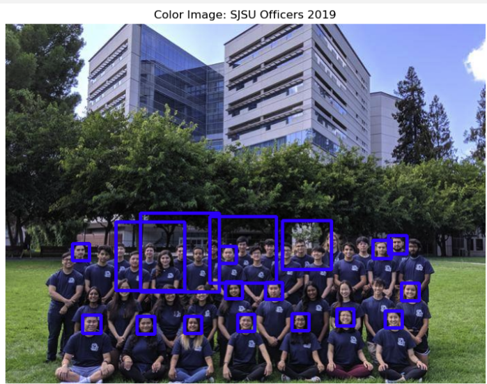
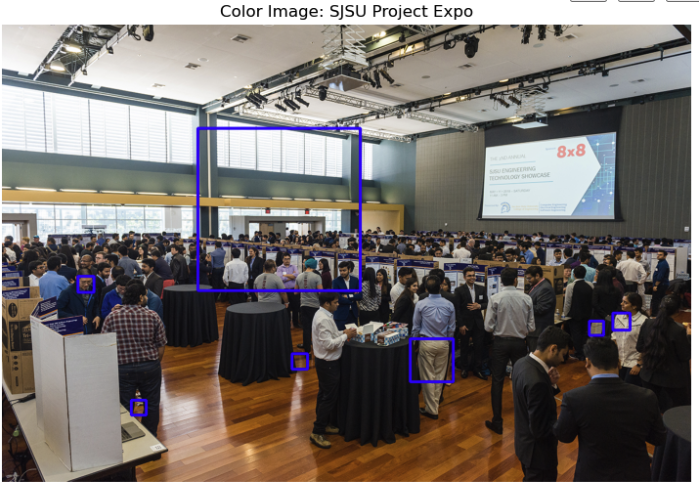

# Image Data Mining

This is an assignment for my CMPE 256 Course (Adv. Data Mining) by Chandrasekar Vuppalapati at SJSU.

The Haarcascade Model trained on a set of Frontal Face images was used for object (face) detection.

The images were of SJSU students and staff, one image had students posing in a way that aligned with the model training, whereas the other was taken
with no posing and therefore the people were facing in any given direction.

Here are the two images:

In the first image, we can see cleaner bounding boxes, and many more of them. This implies we had high accuracy and minimal errors. Still, we had boxes that overlapped so some improvement can be made with selecting appropriate parameters.

In the second image, we have less clean bounding boxes, and less of them. This implies we had less accuracy and more errors. The model didn't seem to like this image as it did not have the faces facing forward. A different haarcascade classifier and different parameters and more comples techniques may be of use.
